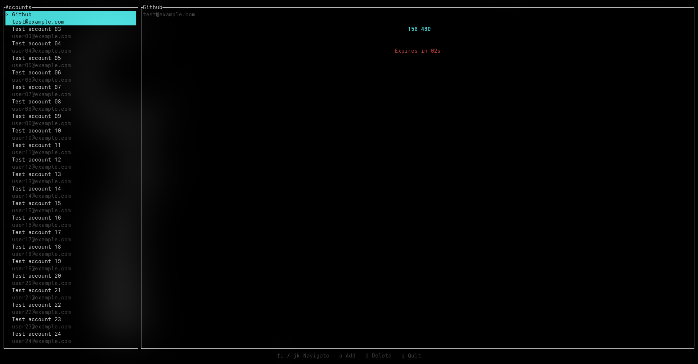

# 🦀 totp-tui 🦀

  

A terminal-based Two-Factor Authentication (TOTP) application built with [Ratatui](https://github.com/ratatui/ratatui) and Rust.

## Features

- **Secure Storage**: Base32 secrets are saved in the operating system's native secure keyring (`gnome-keyring`, KWallet, macOS Keychain, etc.).
- **Metadata Management**: Non-sensitive account metadata is saved locally in JSON format.
- **Live Auto-Refresh**: Generates standard RFC 6238 6-digit TOTP codes with live countdown timers and warning indicators.
- **Responsive Layout**: Adapts layout dynamically based on terminal dimensions.
- **Interactive UI**: Navigate accounts with arrow keys or `j`/`k`, add new accounts interactively (`a`), and delete accounts safely (`d`).

## Keybindings

| Key         | Action                  |
| ----------- | ----------------------- |
| `↑` / `k`   | Move selection up       |
| `↓` / `j`   | Move selection down     |
| `a`         | Add new account         |
| `d`         | Delete selected account |
| `q` / `Esc` | Quit / Cancel           |
